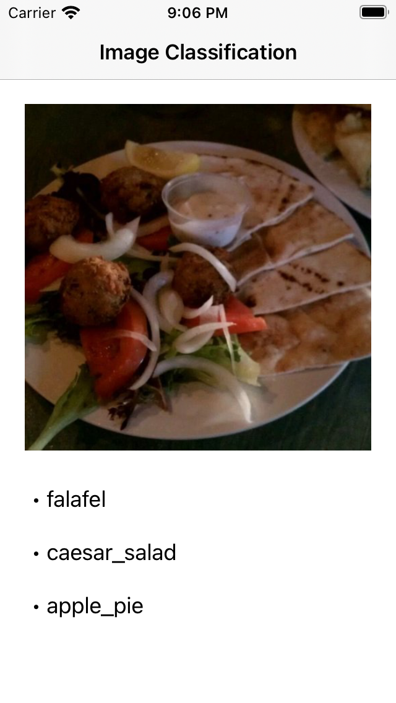

# README

## About

This repo is a tutorial/sample code for :
1. how to train a CV classifier using pytorch
2. Serve the model using pyotrch serving
3. Deploy the model using torchmobile for Android
4. Deploy the model using torchmobile for IOS

## Dataset

This project used the Food 101 dataset

## Demo 

### Android 

### IOS

## References